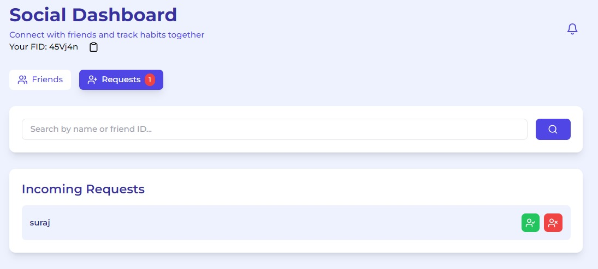
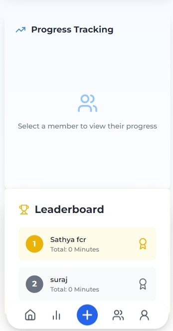
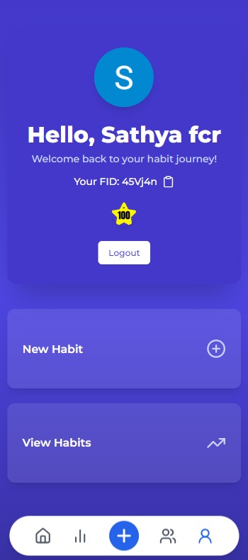

# Habitopia

### Build the better you!

A streak based, habit tracking app that gets you addicted to building good habits and staying productive.

## Key Features:
- Home Page: Look at all your habits at a glance and update the progress on each one of them. Also find date-wise records of your habits.

- New Habit: Allows you to add a new habit (Group or Individual) and set various parameters.

- Explore Page: Sleek Data visualizations that give you in-depth insights into your habit building progress.

- Social Features: Ability to add freinds and access their habit progress. Also opens the door to creation of group habits with friends.

- Group Habits: Can create habits for an entire group of friends and share your progress and track using leaderboard.

- Profile: A showcase of the User's profile, friend code, and the badges earnt by the user for the different score levels.

